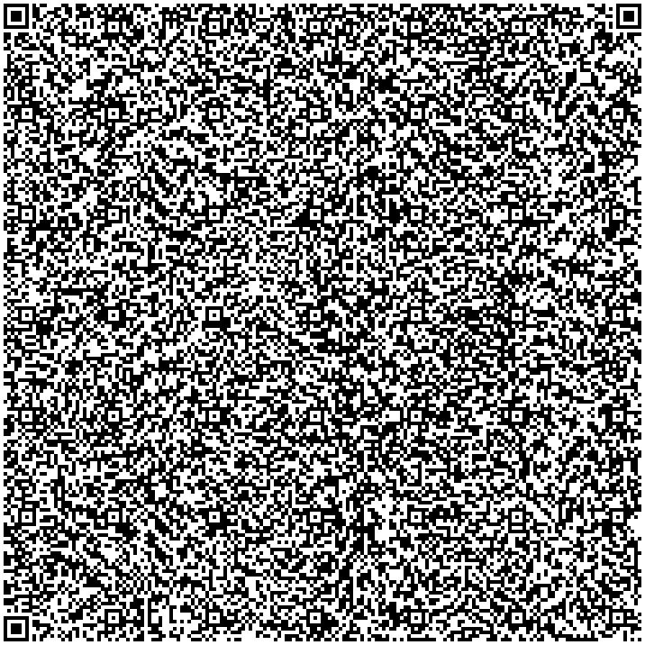
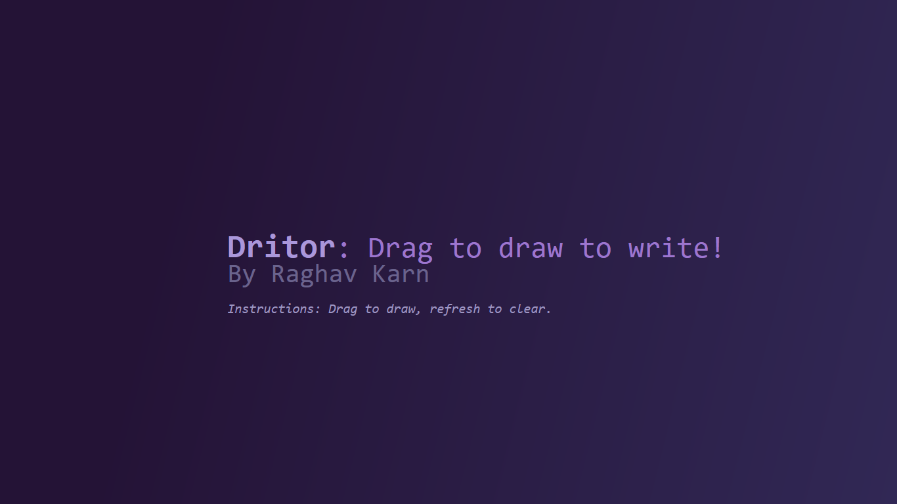
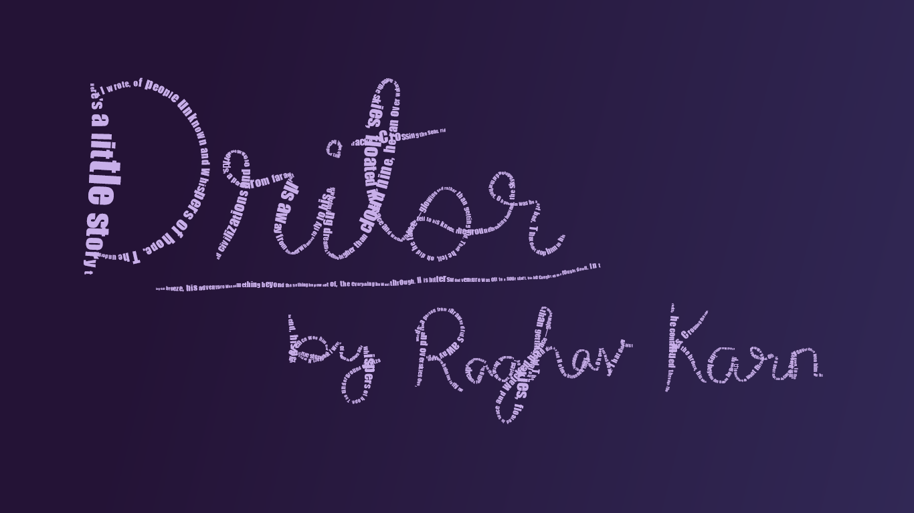

# `Dritor`: Drag to draw to write! 📝
Welcome to the [**Dritor**](https://raghav-karn.github.io/Dritor): *Drag to draw to write!* 
A [SayCheese](https://saycheese.hackclub.com/) project.

**Disclaimer**: This website is recommended to be run on desktop (requires mouse or trackpad). A mobile device with mouse would work equally fine but the website is non-responsive for mobile screens, so splash-screen would be a mess.

## Overview ✨
**Dritor** is a web app where you drag your drawings and learn a new story! All you gotta do is drag the cursor in order to draw whatever you wish, and Dritor would unveil an interesting story/ballad I wrote myself! 

## Images 📸

## How I managed to pull this off 📃
> Dritor was something I had planned long ago, and finally got the chance to ship for [Say Cheese](https://saycheese.hackclub.com) and [High Seas](https://highseas.hackclub.com). I chose this project for Say Cheese because it was a small one, and wouldn't require any external resources either (though I wish I could use some of my favorite fonts from [Google Fonts](https://fonts.google.com).

Here is how I managed to do this:
- Figured out the design I wanted it to be like – simple, neat and eleganto.
- Learned how to make mouse cursor drag-related functions in JS (a painfully fun endeavour).
- Struggled with trying to make the background blurred and have a frosted-glass texture in background, which I sadly couldn't pull it off in time.
- Cooked my first ballad kinda story.

## The fun part — Story time! 😋
> Nawh, no spoilers. Draw and weave out the story yourself (it's incomplete though, because of the limitations on size for QR code ;-;).

## The rough part — QR code¡ 🎊
It was quite a learning experience, getting to know QR codes even better, after watching a [Veritasium video on QRs](https://youtu.be/w5ebcowAJD8?si=frq--31itfdoyxr5) a while ago. Props to [@Burger](https://github.com/hrichiksite) for his proprietary patent-pending [Sandwich](https://sandwich-psi.vercel.app/) technology. I wish I knew it would minify the code as well, had I not used GitHub copilot for so :').

I actually got to learn about DataURLs, which I — pshhh — didn't know were a thing :p. Also, fitting a project inside a QR is so cool, I can now flex to others by saying "Yo, scan this" (though a normal scanner cannot scan such large ones like the v40 ;-;). A great learning experience, and a food to my creative side of brain to weave a story as well.

## Credits 🤝
GitHub Copilot (for minifying the code, minor issues that didn't get fixed anyway), myself

---
